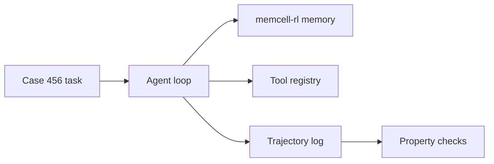

# Building Agentic Systems

I want to show you how to build an agentic system from scratch — not by wrapping an LLM in a framework, but by owning every layer: the loop, the memory, the tools, the stop conditions, and the audit log.

This book follows **one running example** all the way through: **CaseBot**, a regulated case-resolution agent that reviews customer account 456 for fraud indicators. Every chapter adds one layer to the same case. Every code block comes from code you can run.

**Companion code:** [`memcell-rl/examples/casebot_regulated.py`](https://github.com/adu3110/memcell-rl/blob/main/examples/casebot_regulated.py)

```bash
cd memcell-rl
uvicorn memcell_rl.app:app --port 8000   # terminal 1
python examples/casebot_regulated.py --dry-run   # terminal 2
```

---

## About This Series

Most agent tutorials optimize for a demo in twenty lines. That hides the hard parts: **state**, **memory**, **tool reliability**, **planning**, **evaluation**, and **coordination**.

When something breaks in production — an agent waives a fee without approval, loops the same tool call six times, or "forgets" a constraint from turn two — you cannot fix it by tuning the prompt. You need to own the layer that failed.

This series builds each layer explicitly. The LLM is a replaceable HTTP component. The architecture is TypeScript-free Python you can read, run, and audit.

## The Running Example: Case 456

Throughout Book 1 we build CaseBot:

| Step | What happens |
|------|----------------|
| Case opens | Fraud-review constraint loaded for account 456 |
| Lookup | `getAccount` → balance, status |
| History | `getTransactions` → settled transactions |
| Decision | Close case or flag for review |
| Audit | Full trajectory exported to JSON |

Not a coding assistant. Not a chatbot. A system that must remember constraints, call tools safely, log every step, and survive compliance review.



## The Three Books

**Book 1 — Building an Agentic System** *(this book)*  
One agent, one loop, typed memory, tools, planning, stop conditions, trajectory logging. Runnable: `casebot_regulated.py`.

**Book 2 — Making Agentic Systems Reliable** *(draft)*  
Why final-answer accuracy lies, trajectory properties, failure diagnosis, memory policies, benchmarks. Repos: [`llm-evals-from-scratch`](https://github.com/adu3110/llm-evals-from-scratch), [`long-context-bench`](https://github.com/adu3110/long-context-bench).

**Book 3 — Scaling and Coordinating Agentic Systems** *(draft)*  
Multi-agent coordination, append-only ledgers, conflict detection, human-in-the-loop, regulated deployment. Repo: [`agent-ledger`](https://github.com/adu3110/agent-ledger).

Book 1 is complete and runnable. Books 2 and 3 are outlined; they extend the same CaseBot story once the foundation is solid.

## Who This Is For

- Engineers building agent workflows in production
- Researchers who want inspectable, auditable agent architectures
- Teams in regulated domains — finance, healthcare, compliance
- Anyone tired of demo agents that break on week two

## Prerequisites

- Python 3.11+
- Basic LLM API usage (optional for Book 1 — `--dry-run` works without an API key)
- No agent framework experience required

## What You Will Not Find Here

- LangChain / CrewAI / AutoGen tutorials disguised as architecture
- Prompt-engineering-only advice with no systems design
- Code that was never run

## About the Author

I'm **Aditi Chatterji**. I build AI systems from first principles — small transformers, evaluation harnesses, memory architectures, agent workflows. Most of my work is on [GitHub](https://github.com/adu3110). I apply these ideas through [Kyne AI](https://www.kynelabs.ai/) (agent OS for regulated workflows) and [Squirrels Tech](https://www.squirrelstech.org/) (AI education from first principles).

---

**Start reading →** [1. Overview and Philosophy](./book1/02-philosophy.md)
