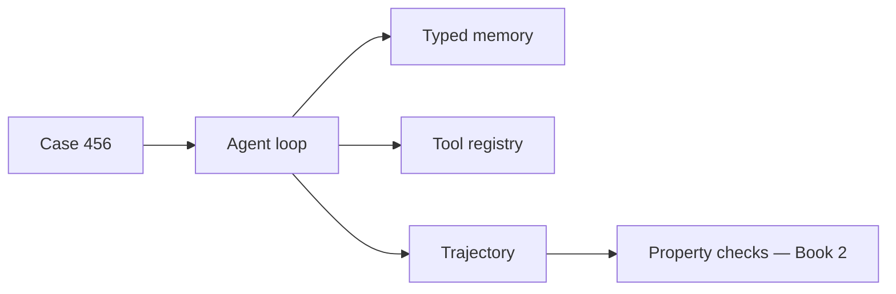

# Building Agentic Systems

I want to show you how to build an agentic system from scratch — no LangChain, no agent framework, no magic. One running example (CaseBot, a regulated case-review agent) and a single build path you type and run chapter by chapter.

## Where to start

| If you… | Start here |
|---------|------------|
| Are new to how LLMs work (tokens, attention, generation) | [Book 0: How LLMs Work](./book0/00-introduction-to-book0.md) |
| Have used LLMs but never built an agent loop | [Book 1 Roadmap](./book1/00-roadmap.md) → chapter 1.1 |
| Built CaseBot and want to evaluate it | [Book 2 Roadmap](./book2/00-roadmap.md) |
| Need multiple agents coordinating safely | [Book 3 Roadmap](./book3/00-roadmap.md) |

**Recommended path:** Book 0 → Book 1 → Book 2 → Book 3. Each book ends exactly where the next begins.

## How to read this book

Each chapter adds **one layer** to the same system. You run code before you read theory. When something breaks, the next chapter fixes it.

```bash
# Clone (if you don't have the repo yet):
git clone https://github.com/adu3110/memcell-rl.git
cd memcell-rl

# Or, from this website workspace:
cd repos/memcell-rl

python3 examples/build/step01_task.py
python3 examples/build/step02_loop.py
# … through step09_stops.py

# Step 10 — full CaseBot (needs memcell-rl server for live memory):
uvicorn memcell_rl.app:app --port 8000   # terminal 1
python3 examples/casebot_regulated.py --dry-run   # terminal 2
# Optional: OPENAI_API_KEY=sk-... python3 examples/casebot_regulated.py --live
```

**Finished artifact:** [`casebot_regulated.py`](https://github.com/adu3110/memcell-rl/blob/main/examples/casebot_regulated.py) — not the starting point. You get there by chapter 1.10.

Every chapter follows the same rhythm:

1. **Where we are** — what CaseBot can do so far  
2. **Run it** — one command, one output (often a failure)  
3. **Why** — the detailed explanation  
4. **What changed** — the new layer in the system  
5. **What breaks next** — why the next chapter exists  

## The spine (one case, one loop)

Case 456: review an account for fraud in a regulated workflow. The agent must lookup account data before any destructive action, respect constraints, log every step, and escalate when it cannot proceed safely.



## Four books

| Book | Question |
|------|----------|
| **0** | What is an LLM, what can't it do alone, when do you need an agent? |
| **1** | How do I build the loop, tools, memory, and log? |
| **2** | How do I know it keeps working? |
| **3** | How do multiple agents coordinate without breaking audit? |

**Next →** [Book 0: How LLMs Work](./book0/00-introduction-to-book0.md) or skip to [Book 1 Roadmap](./book1/00-roadmap.md)
